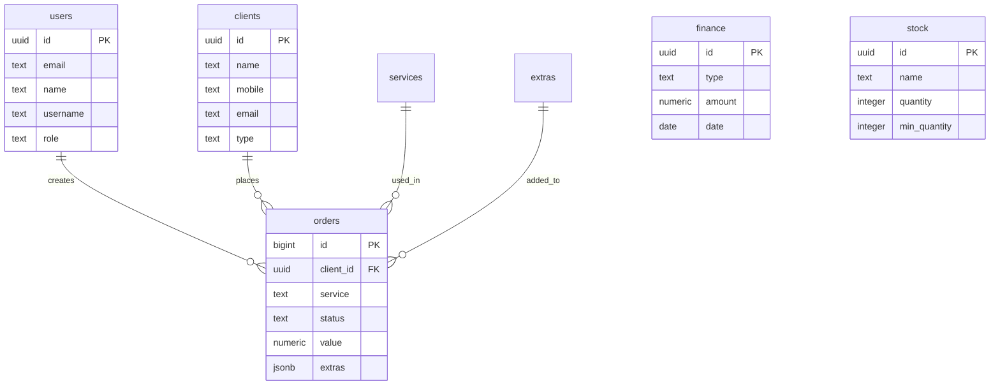

# 📊 Database Schema Documentation

Complete documentation of the Supabase PostgreSQL database schema for the Lavê Laundry Management System.

---

## Tables Overview

| Table | Purpose | RLS Enabled |
|-------|---------|-------------|
| `users` | User accounts and authentication | ✅ |
| `clients` | Customer information | ✅ |
| `orders` | Laundry orders | ✅ |
| `services` | Available laundry services | ✅ |
| `catalog_items` | Service catalog items | ✅ |
| `extras` | Additional services/items | ✅ |
| `finance` | Financial transactions | ✅ |
| `stock` | Inventory management | ✅ |

---

## Table Definitions

### 👤 users

Stores user authentication and profile information.

```sql
CREATE TABLE public.users (
    id UUID PRIMARY KEY REFERENCES auth.users(id) ON DELETE CASCADE,
    email TEXT NOT NULL UNIQUE,
    name TEXT NOT NULL,
    username TEXT NOT NULL UNIQUE,
    role TEXT NOT NULL DEFAULT 'user' CHECK (role IN ('user', 'admin')),
    created_at TIMESTAMPTZ DEFAULT NOW(),
    updated_at TIMESTAMPTZ DEFAULT NOW()
);
```

**Columns:**
- `id` - UUID linked to Supabase Auth
- `email` - User email address
- `name` - Full name
- `username` - Unique username for login
- `role` - User role (`user` or `admin`)
- `created_at` - Account creation timestamp
- `updated_at` - Last update timestamp

**RLS Policies:**
- **SELECT (Public)**: Allow public read for login lookups
- **INSERT (Public)**: Allow public insert for registration
- **UPDATE**: Users can only update their own profile
- **DELETE**: Only admins can delete users

---

### 👥 clients

Customer database for laundry services.

```sql
CREATE TABLE public.clients (
    id UUID PRIMARY KEY DEFAULT gen_random_uuid(),
    name TEXT NOT NULL,
    mobile TEXT,
    email TEXT,
    type TEXT CHECK (type IN ('Pessoa Física', 'Pessoa Jurídica')),
    address TEXT,
    notes TEXT,
    tags TEXT[],
    created_at TIMESTAMPTZ DEFAULT NOW(),
    updated_at TIMESTAMPTZ DEFAULT NOW()
);
```

**Columns:**
- `id` - Unique client identifier
- `name` - Client full name or business name
- `mobile` - Phone number
- `email` - Email address
- `type` - Client type (Individual or Business)
- `address` - Physical address
- `notes` - Additional notes
- `tags` - Array of tags for categorization
- `created_at` - Registration date
- `updated_at` - Last modification date

**RLS Policies:**
- **SELECT**: All authenticated users
- **INSERT**: All authenticated users
- **UPDATE**: All authenticated users
- **DELETE**: Admins only

---

### 📦 orders

Laundry order tracking and management.

```sql
CREATE TABLE public.orders (
    id BIGSERIAL PRIMARY KEY,
    client_id UUID REFERENCES public.clients(id) ON DELETE CASCADE,
    service TEXT NOT NULL,
    details TEXT,
    status TEXT NOT NULL DEFAULT 'Recebido' 
        CHECK (status IN ('Recebido', 'Lavando', 'Pronto', 'Entregue', 'Aguardando', 'Pendente')),
    value NUMERIC(10, 2),
    extras JSONB DEFAULT '[]'::jsonb,
    created_at TIMESTAMPTZ DEFAULT NOW(),
    updated_at TIMESTAMPTZ DEFAULT NOW()
);
```

**Columns:**
- `id` - Auto-increment order number
- `client_id` - Reference to client
- `service` - Service type (e.g., "Lavagem de Roupa")
- `details` - Order details and special instructions
- `status` - Current order status
- `value` - Total order value
- `extras` - JSONB array of additional items
- `created_at` - Order creation timestamp
- `updated_at` - Last status update

**Status Values:**
- `Recebido` - Order received
- `Lavando` - In process
- `Pronto` - Ready for pickup
- `Entregue` - Delivered
- `Aguardando` - Awaiting customer action
- `Pendente` - Pending

**RLS Policies:**
- **SELECT**: All authenticated users
- **INSERT**: All authenticated users
- **UPDATE**: All authenticated users
- **DELETE**: Admins only

---

### 🏷️ services

Catalog of available laundry services.

```sql
CREATE TABLE public.services (
    id UUID PRIMARY KEY DEFAULT gen_random_uuid(),
    name TEXT NOT NULL,
    description TEXT,
    price NUMERIC(10, 2),
    category TEXT,
    created_at TIMESTAMPTZ DEFAULT NOW()
);
```

**Columns:**
- `id` - Unique service identifier
- `name` - Service name
- `description` - Service description
- `price` - Base price
- `category` - Service category

**RLS Policies:**
- **SELECT**: All authenticated users
- **INSERT**: Admins only
- **UPDATE**: Admins only
- **DELETE**: Admins only

---

### 📋 catalog_items

Individual items in the service catalog.

```sql
CREATE TABLE public.catalog_items (
    id UUID PRIMARY KEY DEFAULT gen_random_uuid(),
    name TEXT NOT NULL,
    category TEXT,
    price NUMERIC(10, 2),
    created_at TIMESTAMPTZ DEFAULT NOW()
);
```

**RLS Policies:**
- **SELECT**: All authenticated users
- **INSERT**: Admins only
- **UPDATE**: Admins only
- **DELETE**: Admins only

---

### ➕ extras

Additional services and items that can be added to orders.

```sql
CREATE TABLE public.extras (
    id UUID PRIMARY KEY DEFAULT gen_random_uuid(),
    name TEXT NOT NULL,
    price NUMERIC(10, 2) NOT NULL,
    description TEXT,
    created_at TIMESTAMPTZ DEFAULT NOW()
);
```

**RLS Policies:**
- **SELECT**: All authenticated users
- **INSERT**: Admins only
- **UPDATE**: Admins only
- **DELETE**: Admins only

---

### 💰 finance

Financial transaction records (revenue and expenses).

```sql
CREATE TABLE public.finance (
    id UUID PRIMARY KEY DEFAULT gen_random_uuid(),
    type TEXT NOT NULL CHECK (type IN ('Receita', 'Despesa')),
    description TEXT NOT NULL,
    amount NUMERIC(10, 2) NOT NULL,
    category TEXT,
    date DATE NOT NULL DEFAULT CURRENT_DATE,
    created_at TIMESTAMPTZ DEFAULT NOW(),
    updated_at TIMESTAMPTZ DEFAULT NOW()
);
```

**Columns:**
- `id` - Unique transaction identifier
- `type` - Transaction type (Revenue or Expense)
- `description` - Transaction description
- `amount` - Transaction amount
- `category` - Transaction category
- `date` - Transaction date
- `created_at` - Record creation timestamp
- `updated_at` - Last modification timestamp

**RLS Policies:**
- **SELECT**: All authenticated users
- **INSERT**: All authenticated users
- **UPDATE**: All authenticated users
- **DELETE**: Admins only

---

### 📦 stock

Inventory and supply management.

```sql
CREATE TABLE public.stock (
    id UUID PRIMARY KEY DEFAULT gen_random_uuid(),
    name TEXT NOT NULL,
    category TEXT,
    quantity INTEGER NOT NULL DEFAULT 0,
    min_quantity INTEGER DEFAULT 0,
    unit TEXT,
    created_at TIMESTAMPTZ DEFAULT NOW(),
    updated_at TIMESTAMPTZ DEFAULT NOW()
);
```

**Columns:**
- `id` - Unique item identifier
- `name` - Item name
- `category` - Item category
- `quantity` - Current stock quantity
- `min_quantity` - Minimum stock level (for alerts)
- `unit` - Unit of measurement
- `created_at` - Item creation timestamp
- `updated_at` - Last update timestamp

**RLS Policies:**
- **SELECT**: All authenticated users
- **INSERT**: All authenticated users
- **UPDATE**: All authenticated users
- **DELETE**: Admins only

---

## Relationships



---

## Row Level Security (RLS) Summary

### Permission Matrix

| Table | SELECT | INSERT | UPDATE | DELETE |
|-------|--------|--------|--------|--------|
| **users** | Public (login) | Public (signup) | Own profile | Admin only |
| **clients** | Authenticated | Authenticated | Authenticated | Admin only |
| **orders** | Authenticated | Authenticated | Authenticated | Admin only |
| **services** | Authenticated | Admin only | Admin only | Admin only |
| **catalog_items** | Authenticated | Admin only | Admin only | Admin only |
| **extras** | Authenticated | Admin only | Admin only | Admin only |
| **finance** | Authenticated | Authenticated | Authenticated | Admin only |
| **stock** | Authenticated | Authenticated | Authenticated | Admin only |

### Key Security Features

1. **Authentication Required**: All operations require valid Supabase Auth session
2. **Role-Based Access**: Admin role grants elevated permissions
3. **Data Isolation**: Users can only modify their own profiles
4. **Public Reads**: User table allows public SELECT for login lookup
5. **Cascade Deletion**: Related records deleted when parent is removed

---

## Indexes

Recommended indexes for optimal performance:

```sql
-- Users
CREATE INDEX idx_users_username ON public.users(username);
CREATE INDEX idx_users_email ON public.users(email);

-- Clients
CREATE INDEX idx_clients_name ON public.clients(name);
CREATE INDEX idx_clients_mobile ON public.clients(mobile);

-- Orders
CREATE INDEX idx_orders_client_id ON public.orders(client_id);
CREATE INDEX idx_orders_status ON public.orders(status);
CREATE INDEX idx_orders_created_at ON public.orders(created_at DESC);

-- Finance
CREATE INDEX idx_finance_date ON public.finance(date DESC);
CREATE INDEX idx_finance_type ON public.finance(type);

-- Stock
CREATE INDEX idx_stock_category ON public.stock(category);
```

---

## Migrations

To set up the database, run the SQL scripts in order:

1. **Create tables**: Execute table creation statements
2. **Enable RLS**: `ALTER TABLE table_name ENABLE ROW LEVEL SECURITY;`
3. **Create policies**: Apply RLS policies for each table
4. **Create indexes**: Add performance indexes
5. **Seed data**: Insert initial services, catalog items, and admin user

---

## Backup & Recovery

Supabase provides automatic daily backups. Manual backups can be created via:

```bash
# Using Supabase CLI
supabase db dump -f backup.sql

# Restore from backup
supabase db reset
psql -f backup.sql
```

---

<div align="center">
  📊 Database Schema v1.0 | Last Updated: December 2025
</div>
